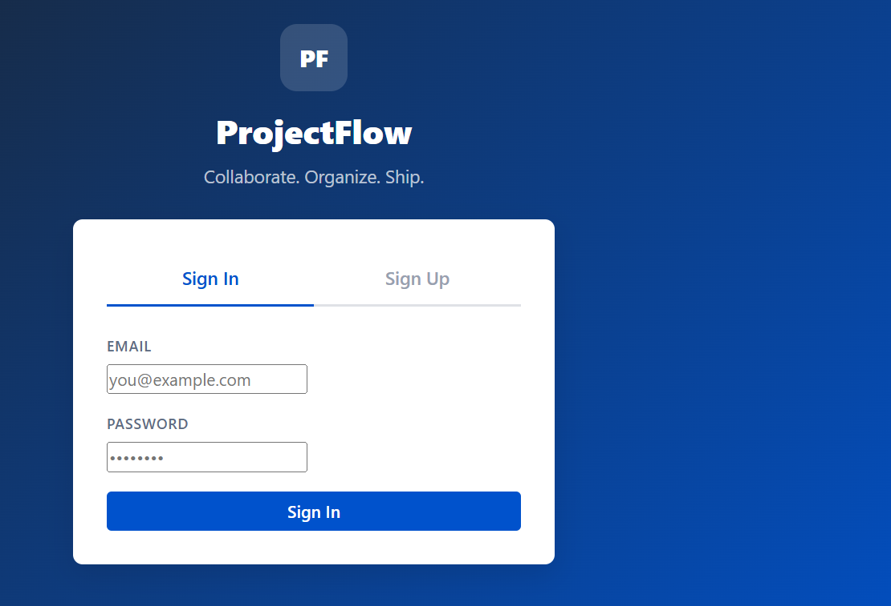
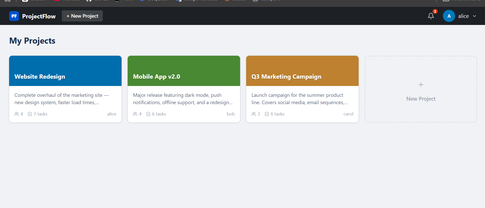
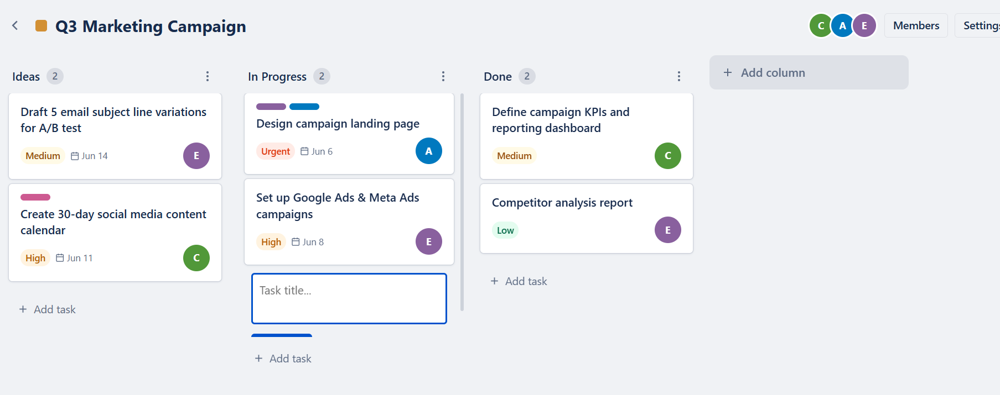
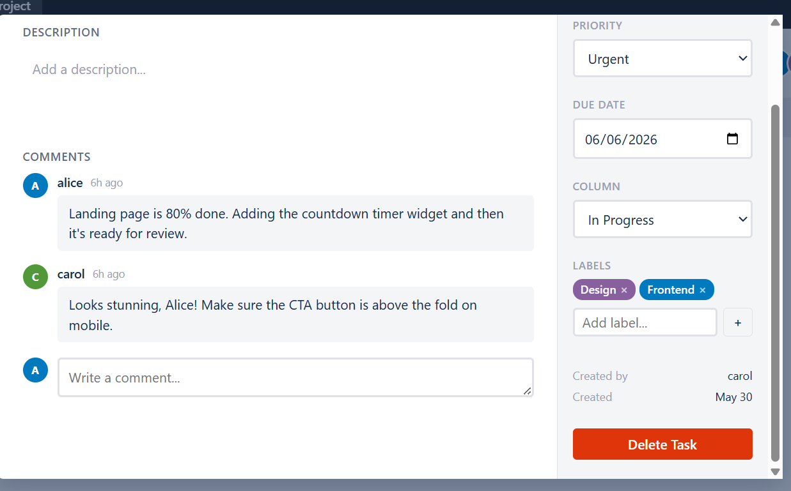

# ProjectFlow — Collaborative Project Management Tool

> A full-stack Trello/Asana-like project management app built with Node.js, Express, Socket.io, and Vanilla JavaScript.

---

## Features

- **JWT Authentication** — Secure register & login system
- **Project Boards** — Create group projects with custom colors
- **Kanban Columns** — Add, rename, and delete columns (To Do, In Progress, Done, etc.)
- **Task Cards** — Create tasks with title, description, priority, due date, labels, and assignee
- **Drag & Drop** — Move tasks between columns with HTML5 drag-and-drop
- **Comments** — Discuss within each task, delete your own comments
- **Member Management** — Invite members by username/email, assign roles (owner / admin / member)
- **Real-time Updates** — Live board sync for all members via WebSockets (Socket.io)
- **Notifications** — In-app notifications with badge count and real-time delivery
- **Responsive UI** — Works on desktop and mobile browsers

---

## Tech Stack

| Layer | Technology |
|-------|-----------|
| Backend | Node.js, Express.js |
| Database | sql.js (SQLite via WebAssembly — no native build needed) |
| Real-time | Socket.io (WebSockets) |
| Auth | JSON Web Tokens (JWT) + bcryptjs |
| Frontend | Vanilla JavaScript (SPA), HTML5, CSS3 |

---

## Project Structure

```
CodeAlpha_Project_Management/
├── server.js                  # Express + Socket.io entry point
├── database.js                # sql.js wrapper with SQLite schema
├── seed.js                    # Demo data seeder
├── middleware/
│   └── auth.js                # JWT authentication middleware
├── routes/
│   ├── auth.js                # Register, login, user search
│   ├── projects.js            # Project CRUD + member management
│   ├── boards.js              # Kanban column CRUD
│   ├── tasks.js               # Task CRUD + move between columns
│   ├── comments.js            # Task comments
│   └── notifications.js      # Notification list + mark read
└── public/
    ├── index.html             # Single-page app shell
    ├── css/
    │   └── style.css          # All styles (no external frameworks)
    └── js/
        ├── api.js             # Fetch API wrapper
        ├── app.js             # Auth, dashboard, routing, socket
        └── board.js           # Kanban board, drag-drop, task modal
```

---

## Getting Started

### Prerequisites

- [Node.js](https://nodejs.org/) v18 or higher
- npm (comes with Node.js)

### Installation

```bash
# 1. Clone the repository
git clone https://github.com/YOUR_USERNAME/CodeAlpha_Project_Management.git
cd CodeAlpha_Project_Management

# 2. Install dependencies
npm install

# 3. (Optional) Seed demo data
npm run seed

# 4. Start the server
npm start
```

Open **http://localhost:3001** in your browser.

---

## Demo Accounts

After running `npm run seed`:

| Email | Password | Role |
|-------|----------|------|
| alice@demo.com | password123 | Member of all 3 projects |
| bob@demo.com | password123 | Owner of Mobile App project |
| carol@demo.com | password123 | Owner of Marketing project |
| david@demo.com | password123 | Member |
| eva@demo.com | password123 | Member |

---

## Seeded Demo Data

| Project | Boards | Tasks |
|---------|--------|-------|
| Website Redesign | To Do, In Progress, Review, Done | 7 tasks |
| Mobile App v2.0 | Backlog, In Progress, QA, Released | 6 tasks |
| Q3 Marketing Campaign | Ideas, In Progress, Done | 6 tasks |

---

## API Endpoints

### Auth
| Method | Endpoint | Description |
|--------|----------|-------------|
| POST | `/api/auth/register` | Create account |
| POST | `/api/auth/login` | Login, returns JWT |
| GET | `/api/auth/me` | Get current user |
| GET | `/api/auth/users/search?q=` | Search users to invite |

### Projects
| Method | Endpoint | Description |
|--------|----------|-------------|
| GET | `/api/projects` | List my projects |
| POST | `/api/projects` | Create project |
| PUT | `/api/projects/:id` | Update project |
| DELETE | `/api/projects/:id` | Delete project |
| POST | `/api/projects/:id/members` | Add member |
| DELETE | `/api/projects/:id/members/:userId` | Remove member |

### Boards (Columns)
| Method | Endpoint | Description |
|--------|----------|-------------|
| GET | `/api/boards/project/:id` | Get all boards + tasks |
| POST | `/api/boards/project/:id` | Create column |
| PUT | `/api/boards/:id` | Rename column |
| DELETE | `/api/boards/:id` | Delete column |

### Tasks
| Method | Endpoint | Description |
|--------|----------|-------------|
| GET | `/api/tasks/:id` | Get task details |
| POST | `/api/tasks/board/:boardId` | Create task |
| PUT | `/api/tasks/:id` | Update task |
| PATCH | `/api/tasks/:id/move` | Move to another column |
| DELETE | `/api/tasks/:id` | Delete task |

### Comments
| Method | Endpoint | Description |
|--------|----------|-------------|
| GET | `/api/comments/task/:taskId` | Get comments |
| POST | `/api/comments/task/:taskId` | Add comment |
| DELETE | `/api/comments/:id` | Delete comment |

### Notifications
| Method | Endpoint | Description |
|--------|----------|-------------|
| GET | `/api/notifications` | Get notifications |
| PATCH | `/api/notifications/:id/read` | Mark as read |
| PATCH | `/api/notifications/read-all` | Mark all as read |

---

## WebSocket Events

| Event | Direction | Description |
|-------|-----------|-------------|
| `join-project` | Client → Server | Subscribe to board updates |
| `task:created` | Server → Client | New task added |
| `task:updated` | Server → Client | Task edited |
| `task:moved` | Server → Client | Task moved to another column |
| `task:deleted` | Server → Client | Task removed |
| `board:created` | Server → Client | New column added |
| `comment:added` | Server → Client | New comment posted |
| `notification:new` | Server → Client | Personal notification delivered |

---

## Screenshots

> Register / Login



> Project Dashboard



> Kanban Board



> Task Detail Modal


---

## Built As Part Of

This project was built as part of the **CodeAlpha Internship Program**.

---

## License

MIT License — free to use and modify.
